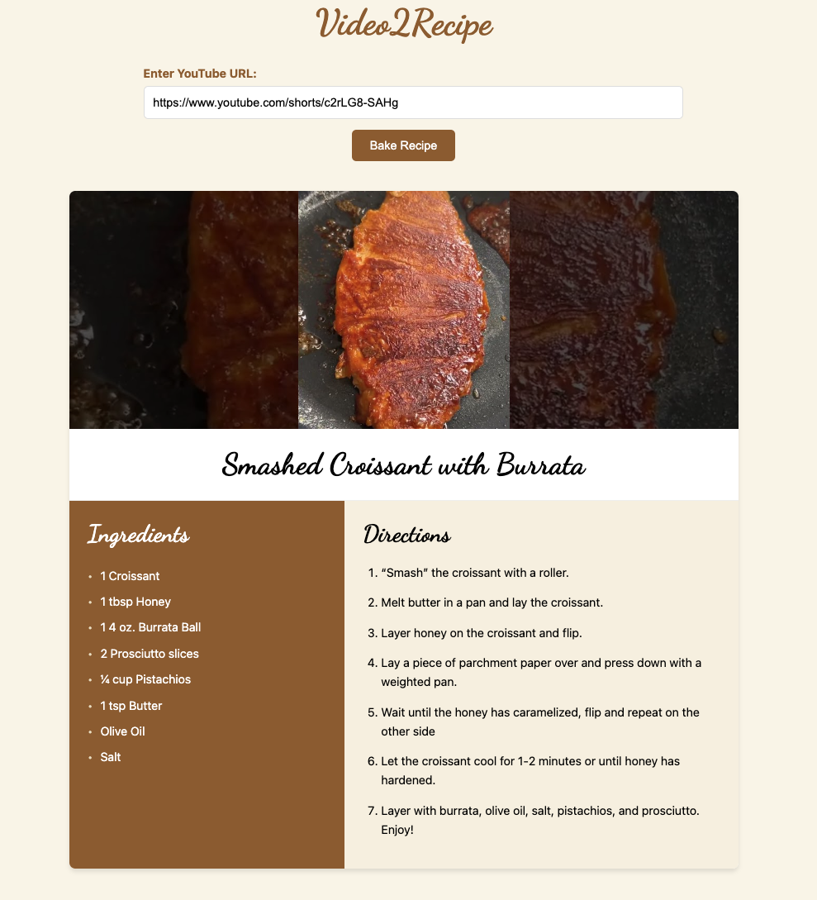

# Video2Recipe



Video2Recipe is an elegant web application that transforms YouTube cooking videos into beautifully formatted recipe cards. Simply paste a YouTube URL, click "Bake Recipe," and watch as our AI extracts the recipe details and presents them in a cookbook-style format.

## Features

- 🎥 **YouTube Integration**: Supports regular YouTube videos, Shorts, and youtu.be links
- 🤖 **AI-Powered Extraction**: Uses ☁️ CloudGlue API to extract recipe details from video content
- 📝 **Elegant Recipe Cards**: Presents recipes in a beautiful cookbook-style format

## How It Works

1. **Input a URL**: Paste any YouTube cooking video URL
2. **Extract Recipe**: Our AI analyzes the video to identify recipe name, ingredients, and steps
3. **Get Your Recipe**: View and save your beautifully formatted recipe card

## Technology Stack

- **Frontend**: Next.js, React
- **Styling**: CSS-in-JS with inline styles
- **AI Integration**: ☁️ CloudGlue API for recipe extraction
- **Image Handling**: YouTube thumbnail extraction

## Installation

1. Clone the repository:
   ```bash
   git clone https://github.com/kdr/video-to-recipe-card.git
   cd video-to-recipe-card
   ```

2. Install dependencies:
   ```bash
   npm install
   ```

3. Create a `.env.local` file in the root directory with your ☁️ [CloudGlue API](https://cloudglue.dev/) key:
   ```
   CLOUDGLUE_API_KEY=your-api-key-here
   ```

4. Start the development server:
   ```bash
   npm run dev
   ```

5. Open [http://localhost:3000](http://localhost:3000) in your browser

## Deployment

This project is designed to be easily deployed on Vercel:

1. Push your code to a GitHub repository
2. Import the project to Vercel
3. Add your ☁️ CloudGlue API key as an environment variable
4. Deploy!

## Usage Examples

Perfect for:
- Saving recipes from your favorite YouTube cooking channels
- Creating a personal cookbook from online videos
- Sharing recipes with friends in a clean, readable format
